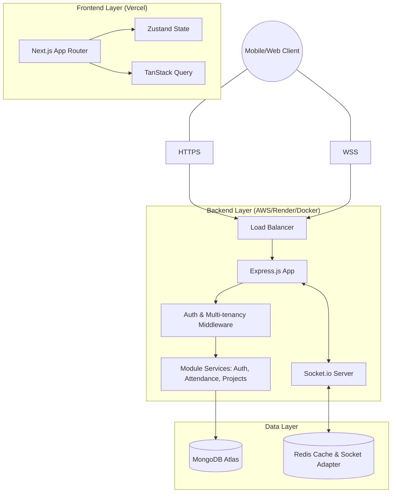

# Enterprise SaaS Architecture Blueprint

This document specifies the technical design for a highly scalable, modular, and secure enterprise SaaS application.

## 1. Monorepo Structure (Turborepo)

A Monorepo is strongly recommended for this project to allow sharing of Zod schemas and TypeScript interfaces between the frontend and backend, ensuring end-to-end type safety.

```text
/
├── apps/
│   ├── web/ (Next.js + Tailwind)
│   │   ├── src/
│   │   │   ├── app/ (App Router)
│   │   │   ├── components/ (Atomic Design: ui, layouts, features)
│   │   │   ├── hooks/ (TanStack Query mutations/queries)
│   │   │   ├── store/ (Zustand state)
│   │   │   └── services/ (Axios/Fetch instances)
│   ├── api/ (Express.js + TypeScript)
│   │   ├── src/
│   │   │   ├── modules/ (Feature-based structure)
│   │   │   ├── middleware/ (Auth, RBAC, Validation)
│   │   │   └── core/ (Error handling, Logger, Base classes)
├── packages/
│   ├── shared/ (Zod schemas, Shared Types, Constants)
│   ├── config/ (Tailwind, ESLint, TS configs)
├── docker-compose.yml
└── package.json
```

---

## 2. Architecture Diagram



---

## 3. API Structure & Routes Pattern

- **Versioning**: `/api/v1`
- **Naming**: Resources use plural nouns (e.g., `/api/v1/projects`).
- **Multi-tenancy Enforcement**: Every request must pass through a middleware that extracts the `organizationId` from the JWT and injects it into `req.orgId`. All subsequent database queries MUST filter by this ID.

**Standard Request Flow:**
`Route` → `AuthMiddleware` → `ValidationMiddleware (Zod)` → `Controller` → `Service` → `Repository`

---

## 4. Multi-Tenant Database Design (MongoDB)

### Schema Partitioning
We use a **Shared Database, Shared Schema** approach with an `organizationId` discriminator for maximum scalability.

- **Indexing**: A mandatory compound index on `{ organizationId: 1, _id: 1 }` and `{ organizationId: 1, createdAt: -1 }` on all collections.
- **Enforcement**: Base Repository class that automatically appends the `organizationId` filter to all Mongoose queries.

**Conceptual Data Model:**
- **Attendance**: `{ userId, orgId, date, checkIn, checkOut, breaks: [] }`
- **Projects**: `{ name, orgId, description, status, members: [] }`

---

## 5. Security & Auth Flow (JWT + RBAC)

- **Authentication**: JWT-based with Access Tokens (short-lived) and Refresh Tokens (long-lived, stored in a secure HttpOnly cookie).
- **Authorization**: Role-Based Access Control (RBAC). Roles (Admin, Manager, Employee) have specific permissions.
- **Sanitization**: All incoming data is sanitized using `xss-clean` and strictly validated using `Zod`.
- **Headers**: Use `Helmet` to set secure HTTP headers.

---

## 6. Real-Time Strategy

- **Namespace/Room Isolation**: Each organization has its own Socket.io room: `socket.join(orgId)`.
- **Event Naming Convention**: `[module]:[action]` (e.g., `attendance:update-time`).
- **Adapter**: Use the Redis adapter for Socket.io to support multiple backend instances and horizontal scaling.

---

## 7. Performance & Scalability

1. **Lazy Loading**: Utilize Next.js dynamic imports for heavy client-side charts/modals.
2. **Data Prefetching**: Prefetch critical data using TanStack Query during SSR or hover events.
3. **Database Caching**: Use Redis for frequently accessed but rarely changed data (e.g., organization settings, user profile metadata).
4. **Horizontal Scaling**: Backend services deployed as Docker containers, easily scalable using AWS ECS or Kubernetes.

---

## 8. Development Standards & Globalization

- **Code Quality**: Strict TypeScript mode, ESLint (Prettier), and Husky for pre-commit hooks.
- **Localization (i18n)**: All strings externalized to JSON files. Backend returns localized error messages based on `Accept-Language` header.
- **Timezones**: Always store timestamps in UTC. Convert to user’s local timezone on the frontend.

---

## 9. Future-Proofing (Modular Plug-and-Play)

- **Service Layer Abstraction**: Modules should never call repositories of other modules. Instead, use cross-module service calls.
- **Pub/Sub Mechanism**: Use an internal Event Bus for decoupled communication between modules (e.g., Attendance module emits `attendance.created`, and Task module updates the status of an ongoing task).
- **Phasewise Integration**: New modules (Analytics, Billing) just need to implement the standard Service/Repository interface and register their routes in the main API entry point.
